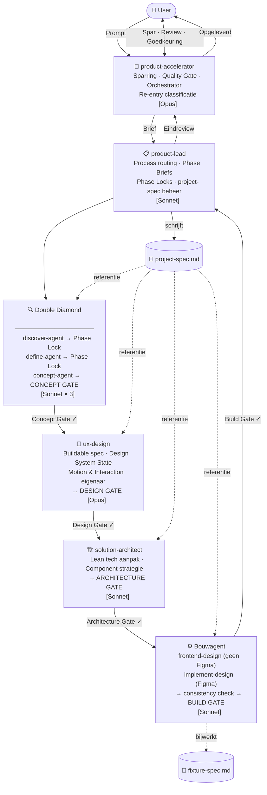

# Claude Agent Pipeline

> A multi-agent orchestration system for building focused, high-quality B2B prototypes — following the Double Diamond methodology with quality gates at every phase transition.

---

## How It Works

Every request starts with **product-accelerator**. It reads the brief, applies a business lens, and decides whether to answer directly or activate **product-lead** to run a structured process.

The pipeline follows four phases (Discover → Define → Concept → Build) with a mandatory quality gate between each phase. Gates are always evaluated by a domain agent + `qa-agent` together. Nothing moves forward without a gate verdict.

Two persistent files travel through the entire pipeline:

| File | Purpose |
|------|---------|
| `project-spec.md` | Living project memory — organizing concept, decisions, design system, component register, snapshot log |
| `fixture-spec.md` | Scenario test instrument — hypothesis coverage, user status × data volume matrix |

---

## Pipeline Overview

---

## Agents

| Agent | Model | Rol |
|-------|-------|-----|
| `product-accelerator` | Opus | Primair aanspreekpunt · Sparring · Quality Gate · Eindreviewer |
| `product-lead` | Sonnet | Process routing · Phase Briefs · Phase Locks · project-spec |
| `discover-agent` | Sonnet | Onderzoek · Gebruikersbehoeften · Probleemruimte |
| `define-agent` | Sonnet | POV · HMW · Succesmetrics · Probleemstelling |
| `concept-agent` | Sonnet | Conceptrichtingen · Flows · Aanbeveling |
| `ux-design` | Opus | Buildable spec · Design System State · Motion · Consistency check |
| `qa-agent` | Opus | Onafhankelijke kwaliteitspoort op alle vier gates |
| `solution-architect` | Sonnet | Lean tech aanpak · Component strategie · Datamodel |
| `frontend-design` | Sonnet | Greenfield UI bouwen (geen Figma) |
| `implement-design` | Sonnet | Figma → Production code |

---

## Four Quality Gates

| Gate | Deelnemers | Centrale vraag |
|------|-----------|----------------|
| **Concept Gate** | `concept-agent` + `qa-agent` | Is de richting gefundeerd genoeg om te designen? |
| **Design Gate** | `ux-design` + `qa-agent` | Is het design sterk genoeg om te bouwen? |
| **Architecture Gate** | `solution-architect` + `product-accelerator` + `qa-agent` | Klopt de technische aanpak met de schaal en het probleemstatement? |
| **Build Gate** | bouwagent + `ux-design` + `qa-agent` | Matcht de build met het probleemstatement, fixture hypotheses gedekt, analytics geïnstrumenteerd? |

Elke gate heeft twee uitkomsten: **Ship ✓** (doorgaan naar volgende fase) of **Rethink ✗** (terug naar dezelfde fase).

---

## Session Bootstrap

Elke nieuwe sessie start met een verplicht bootstrap protocol — vóór elke andere actie:

1. Lees `project-spec.md` — fase, versie, organizing concept
2. Lees `fixture-spec.md` — scenario's en hypotheses
3. Lees componentregister — huidige atomic design staat
4. Bepaal huidige fase + versie op basis van bovenstaande
5. Bevestig volgende stap met de gebruiker

Geen agent start vóór de bootstrap bevestigd is.

---

## Persistent Files

### project-spec.md
Gedeeld projectgeheugen. Alle agents lezen dit bestand. `product-lead` schrijft het bij na elke fase en iteratie.

Bevat: Executive Summary · Organizing Concept · Probleemstelling · Beslissingen + auteur · Scope · Phase Locks · Design System State · Design tokens · Componentregister (Atomic) · Motion & Interaction principes · Refinement iteraties + versie · Snapshot Log · Open Risico's

### fixture-spec.md
Scenario-testinstrument. Elke bouwagent bijwerkt dit na elke bouwiteratie.

Bevat: Scenario's per hypothese · Gebruikersstatus (nieuw/bestaand) × Datavolume (leeg/weinig/veel) matrix · Analytics events per scenario

---

## Refinement Re-entry

Bij elke iteratieprompt classificeert `product-accelerator` de re-entry vóór de pipeline start:

| Type | Re-entry bij | Vereist |
|------|-------------|---------|
| Concept aanpassing | `concept-agent` | Alle gates |
| Design tweak — functioneel | `ux-design` | Design + Architecture + Build gate |
| Architectuur tweak | `solution-architect` | Architecture + Build gate |
| Design tweak — cosmetic (nano-tweak) | bouwagent | Consistency check + Build gate |
| Nieuwe prototype variant | `concept-agent` | Volledige cyclus naast bestaande |

Risicovolle iteraties vereisen een snapshot vóór de pipeline start: `snapshot-v[n]-[datum]`.
