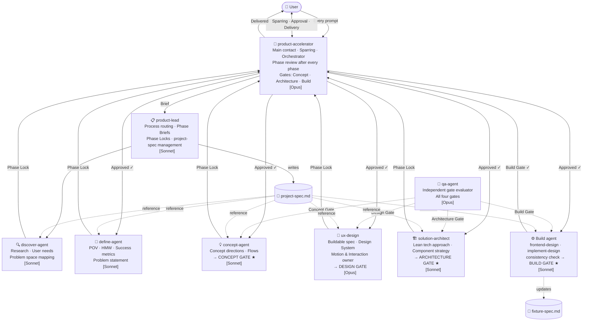

# Claude Agent Pipeline

> A multi-agent orchestration system for building focused, high-quality B2B prototypes — following the Double Diamond methodology with quality gates at every phase transition.

---

## How It Works

Every request starts with **product-accelerator**. It reads the brief, applies a business lens, and decides whether to answer directly or activate **product-lead** to run a structured process.

The pipeline follows four phases (Discover → Define → Concept → Build) with a mandatory quality gate between each phase. Gates are always evaluated by a domain agent + `qa-agent` together. Nothing moves forward without a gate verdict.

Two persistent files travel through the entire pipeline:

| File | Purpose |
|------|---------|
| `project-spec.md` | Living project memory — organizing concept, decisions, design system, component register, snapshot log |
| `fixture-spec.md` | Scenario test instrument — hypothesis coverage, user status × data volume matrix |

---

## Pipeline Overview

> ★ = product-accelerator is an active gate participant alongside qa-agent

---

## Agents

| Agent | Model | Role |
|-------|-------|------|
| `product-accelerator` | Opus | Primary point of contact · Sparring · Quality Gate · Final reviewer |
| `product-lead` | Sonnet | Process routing · Phase Briefs · Phase Locks · project-spec management |
| `discover-agent` | Sonnet | Research · User needs · Problem space mapping |
| `define-agent` | Sonnet | POV · HMW · Success metrics · Problem statement |
| `concept-agent` | Sonnet | Concept directions · Flows · Recommendation |
| `ux-design` | Opus | Buildable spec · Design System State · Motion owner · Consistency check |
| `qa-agent` | Opus | Independent quality gate at all four gates |
| `solution-architect` | Sonnet | Lean tech approach · Component strategy · Data model |
| `frontend-design` | Sonnet | Greenfield UI build (no Figma) |
| `implement-design` | Sonnet | Figma → Production code |

---

## Four Quality Gates

| Gate | Participants | Core question |
|------|-------------|---------------|
| **Concept Gate** ★ | `concept-agent` + `qa-agent` + `product-accelerator` | Is the direction grounded enough to design from? |
| **Design Gate** | `ux-design` + `qa-agent` | Is the design strong enough to build from? |
| **Architecture Gate** ★ | `solution-architect` + `qa-agent` + `product-accelerator` | Does the technical approach match the scale and problem statement? |
| **Build Gate** ★ | `frontend-design`/`implement-design` + `ux-design` + `qa-agent` + `product-accelerator` | Does the build match the problem statement, fixture hypotheses covered, analytics instrumented? |

> ★ = product-accelerator is an active co-evaluator alongside qa-agent at this gate

Each gate has two outcomes: **Ship ✓** (proceed to next phase) or **Rethink ✗** (return to the same phase).

---

## Session Bootstrap

Every new session starts with a mandatory bootstrap protocol — before any other action:

1. Read `project-spec.md` — phase, version, organizing concept
2. Read `fixture-spec.md` — scenarios and hypotheses
3. Read component register — current atomic design state
4. Determine current phase + version from the above
5. Confirm next step with the user

No agent starts before bootstrap is confirmed.

---

## Persistent Files

### project-spec.md
Shared project memory. All agents read this file. `product-lead` updates it after each phase and iteration.

Contains: Executive Summary · Organizing Concept · Problem Statement · Decisions + author · Scope · Phase Locks · Design System State · Design tokens · Component Register (Atomic) · Motion & Interaction principles · Refinement iterations + version · Snapshot Log · Open Risks

### fixture-spec.md
Scenario test instrument. Each build agent updates this after every build iteration.

Contains: Scenarios per hypothesis · User status (new/existing) × Data volume (empty/sparse/full) matrix · Analytics events per scenario

---

## Refinement Re-entry

On every iteration prompt, `product-accelerator` classifies the re-entry before the pipeline starts:

| Type | Re-entry at | Requires |
|------|------------|---------|
| Concept change | `concept-agent` | All gates |
| Design tweak — functional | `ux-design` | Design + Architecture + Build gate |
| Architecture tweak | `solution-architect` | Architecture + Build gate |
| Design tweak — cosmetic (nano-tweak) | build agent | Consistency check + Build gate |
| New prototype variant | `concept-agent` | Full cycle alongside existing variant |

Risky iterations require a snapshot before the pipeline starts: `snapshot-v[n]-[date]`.
